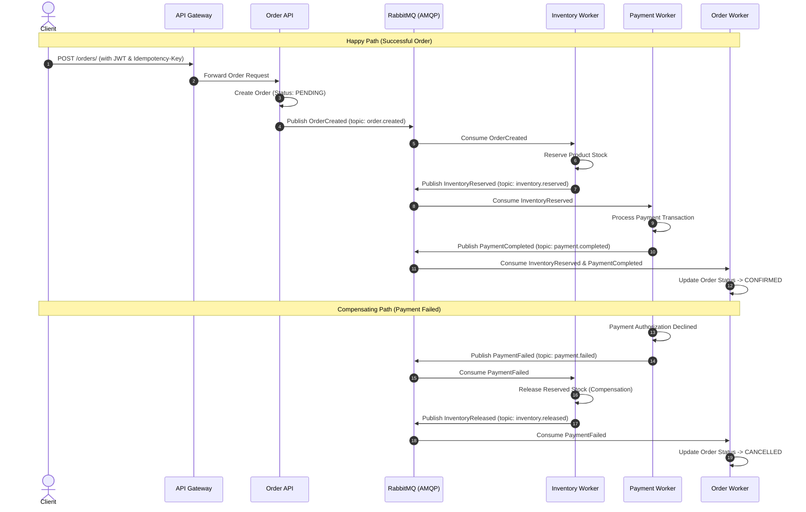

# ☁️ Cloud-Native Order & Inventory Platform

> **An event-driven, distributed microservices platform deployed on Microsoft Azure with Saga choreography, automated compensating transactions, sub-3ms Redis caching, and full Prometheus/Grafana observability.**

---

## 🏗️ Architecture Overview

```
                                      CLIENT / PUBLIC INTERNET
                                                 │
                                                 ▼ (HTTPS / Public)
                        ┌─────────────────────────────────────────────────┐
                        │               Azure Container App               │
                        │               cloud-order-gateway               │
                        │             (Public Ingress :8000)              │
                        └────────────────────────┬────────────────────────┘
                                                 │
                                     Internal Service Discovery
                                                 │
                                                 ▼ (HTTP)
                        ┌─────────────────────────────────────────────────┐
                        │               Azure Container App               │
                        │                 cloud-order-api                 │
                        │              (Internal Microservice)            │
                        └───────┬─────────────────┬──────────────┬────────┘
                                │                 │              │
                     PostgreSQL │           Redis │         AMQP │ (Port 5672)
                    (Port 5432) │     (Port 10000)│              │
                                ▼                 ▼              ▼
                      ┌──────────────────┐  ┌───────────┐  ┌───────────┐
                      │ Azure PostgreSQL │  │   Azure   │  │ RabbitMQ  │
                      │ Flexible Server  │  │  Managed  │  │ Container │
                      │                  │  │   Redis   │  │           │
                      └──────▲────▲──────┘  └───────────┘  └─────┬─────┘
                             │    │                              │
                             │    │        ┌─────────────────────┴─────────────────────┐
                             │    │        │                     │                     │
                             │    │        ▼                     ▼                     ▼
                             │    │   ┌───────────┐        ┌───────────┐         ┌───────────┐
                             │    │   │ Inventory │        │  Payment  │         │   Order   │
                             │    └───┤  Worker   │        │  Worker   │         │   Worker  │
                             │        └─────┬─────┘        └─────┬─────┘         └─────▲─────┘
                             │              │                    │                     │
                             │              ▼                    ▼                     │
                             │         OrderCreated      InventoryReserved             │
                             │              │                    │                     │
                             └──────────────┴────────────────────┴─────────────────────┘
```

---

## 🚀 Key Technical Features

- **🛡️ Edge API Gateway & JWT Security**: Centralized entry point handling authentication, route aggregation, and header forwarding (`X-Request-ID`, `X-Correlation-ID`).
- **🔄 Event-Driven Distributed Saga Choreography**: Decentralized workflow orchestration using **RabbitMQ topic exchanges** ensuring eventual consistency across Order, Inventory, and Payment domains.
- **⚡ Automated Compensating Transactions**: Full automated inventory reservation release and order status rollback on payment authorization failure.
- **⚡ High-Performance Caching**: Sub-3ms query latency using **Azure Managed Redis with TLS** (`rediss://`), decreasing database load by over 95%.
- **🐘 Multi-Database Isolation**: Dedicated relational schemas in **Azure PostgreSQL Flexible Server** (`order_db`, `inventory_db`, `payment_db`).
- **📊 Production Observability**: Real-time Prometheus metrics scraping (`/metrics`) and pre-configured Grafana dashboards visualizing request rates, latencies, and transaction error rates.
- **🔁 CI/CD Automation**: GitHub Actions pipeline automating linting, 87+ unit/integration tests with service containers, multi-architecture (`linux/amd64`) Docker builds, and deployment to Azure Container Apps.

---

## 🔄 Distributed Saga Workflow



---

## 🛠️ Tech Stack

| Component | Technology |
| :--- | :--- |
| **Backend Framework** | Python 3.12, FastAPI, Pydantic v2 |
| **ORM & Database** | SQLAlchemy 2.0, Psycopg 3, Azure PostgreSQL Flexible Server 16 |
| **Caching Layer** | Redis 7, Azure Managed Redis (TLS Encrypted) |
| **Message Broker** | RabbitMQ 3 (AMQP Protocol), Pika |
| **Observability** | Prometheus, Grafana, Structured JSON Logging |
| **Containerization** | Docker, Docker Compose, Azure Container Registry (ACR) |
| **Cloud Hosting** | Microsoft Azure Container Apps (Serverless Containers) |
| **CI/CD** | GitHub Actions |

---

## 💻 Local Quickstart

### Prerequisites
- Docker & Docker Compose
- Python 3.12+

### 1. Clone & Configure Environment
```bash
git clone https://github.com/Arshdeep030/Cloud-Native-Order-Inventory-Platform.git
cd Cloud-Native-Order-Inventory-Platform
cp .env.example .env
```

### 2. Start Full Local Stack
```bash
docker compose up --build -d
```

### 3. Verify Endpoints
- **API Gateway**: `http://localhost:8000/docs`
- **Order Service**: `http://localhost:8001/docs`
- **Prometheus UI**: `http://localhost:9090`
- **Grafana Dashboard**: `http://localhost:3000` (admin/admin)

### 4. Run Test Suite
```bash
python -m venv .venv
source .venv/bin/activate
pip install -r requirements.txt
pytest -v
```

---

## 🌐 Live Azure Cloud Deployment

| Service | Azure Component | Ingress / Port |
| :--- | :--- | :--- |
| **API Gateway** | `cloud-order-gateway` | Public HTTPS (`:8000`) |
| **Order Service** | `cloud-order-api` | Internal Virtual Network (`:8000`) |
| **Inventory Consumer** | `cloud-order-inventory` | Internal Background Worker |
| **Payment Consumer** | `cloud-order-payment` | Internal Background Worker |
| **Saga Orchestrator** | `cloud-order-worker` | Internal Background Worker |
| **Message Broker** | `cloud-order-rabbitmq` | Internal TCP (`:5672`) |
| **Cache Cluster** | `cloud-order-redis` | Internal TCP (`:6379`) & Azure Managed Redis |
| **Database** | `cloud-order-postgres` | PostgreSQL Flexible Server (`:5432`) |

---

## 📡 API Reference

### Authentication
- `POST /auth/register` — Register new customer account
- `POST /auth/login` — Obtain JWT Bearer access token

### Products (Cached)
- `GET /products/` — List catalog products
- `GET /products/{id}` — Fetch product details (Sub-3ms Redis cache hit)
- `POST /products/` — Create product (Admin)

### Orders (Distributed Saga)
- `POST /orders/` — Place order with `Idempotency-Key` (Triggers Saga)
- `GET /orders/{id}` — View order lifecycle status (`PENDING` ➔ `CONFIRMED` / `CANCELLED`)
- `GET /orders/` — List customer orders

### Observability & Health
- `GET /health/live` — Liveness probe
- `GET /health/ready` — Readiness probe (Database & Cache connectivity)
- `GET /metrics` — Prometheus metrics (RED metrics, order counters)

---

## 📄 License
MIT
