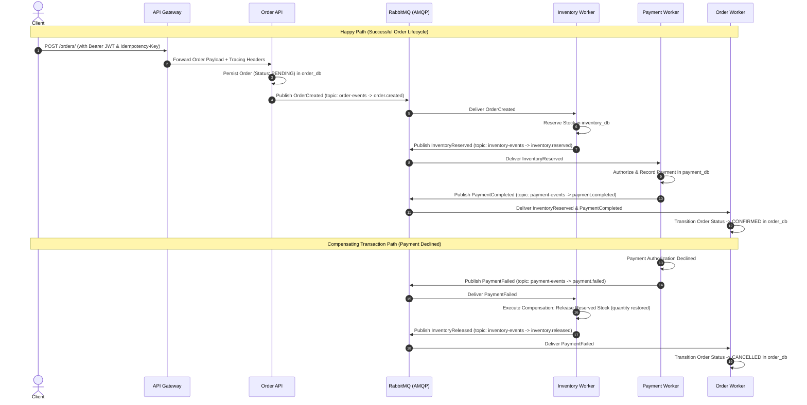

# ☁️ Cloud-Native Order & Inventory Platform

[](https://github.com/Arshdeep030/Cloud-Native-Order-Inventory-Platform/actions/workflows/ci.yml)
[](https://fastapi.tiangolo.com)
[](https://www.python.org/)
[](https://www.postgresql.org/)
[](https://redis.io/)
[](https://www.rabbitmq.com/)
[](https://azure.microsoft.com/)
[](https://prometheus.io/)
[](https://grafana.com/)

> **A production-grade, event-driven distributed microservices platform deployed on Microsoft Azure. Features decentralized Saga choreography, automated compensating transactions, sub-3ms Redis caching, full RED metric observability, and an automated GitHub Actions CI/CD pipeline.**

---

## 📑 Table of Contents

- [1. System Architecture](#1-system-architecture)
- [2. Component Rationale](#2-component-rationale)
- [3. Distributed Saga & Compensating Transactions](#3-distributed-saga--compensating-transactions)
- [4. Technology Stack](#4-technology-stack)
- [5. Observability & Telemetry](#5-observability--telemetry)
- [6. CI/CD Pipeline & Build Strategy](#6-cicd-pipeline--build-strategy)
- [7. Local Development Quickstart](#7-local-development-quickstart)
- [8. Azure Cloud Infrastructure](#8-azure-cloud-infrastructure)
- [9. API Reference & Live Curl Recipes](#9-api-reference--live-curl-recipes)
- [10. Testing & Verification](#10-testing--verification)

---

## 1. System Architecture

```
                                  PUBLIC INTERNET
                                         │
                                         ▼ (HTTPS)
                 ┌───────────────────────────────────────────────┐
                 │             Edge API Gateway                  │
                 │         Azure Container App (Public)          │
                 │    JWT Validation • Route Forwarding • RED    │
                 └───────────────────────┬───────────────────────┘
                                         │
                             Internal Virtual Network
                                         │
                                         ▼ (HTTP)
                 ┌───────────────────────────────────────────────┐
                 │                 Order API                     │
                 │        FastAPI Internal Microservice          │
                 │     Catalog • Idempotency • Order State       │
                 └───────┬───────────────────────┬───────┬───────┘
                         │                       │       │
              PostgreSQL │                 Redis │  AMQP │ (Port 5672)
             (Port 5432) │          (Port 10000) │       │
                         ▼                       ▼       ▼
              ┌──────────────────┐    ┌─────────────┐  ┌──────────────────┐
              │ Azure PostgreSQL │    │Azure Managed│  │  RabbitMQ AMQP   │
              │ Flexible Server  │    │ Redis (TLS) │  │  Message Broker  │
              └──────▲────▲──────┘    └─────────────┘  └────────┬─────────┘
                     │    │                                     │
                     │    │        ┌────────────────────────────┼────────────────────────────┐
                     │    │        │                            │                            │
                     │    │        ▼                            ▼                            ▼
                     │    │ ┌──────────────┐             ┌──────────────┐             ┌──────────────┐
                     │    │ │  Inventory   │             │   Payment    │             │ Order Worker │
                     │    └─┤    Worker    │             │    Worker    │             │ Saga Engine  │
                     │      └──────┬───────┘             └──────┬───────┘             └──────▲───────┘
                     │             │                            │                            │
                     │             ▼                            ▼                            │
                     │        OrderCreated              InventoryReserved                    │
                     │             │                            │                            │
                     └─────────────┴────────────────────────────┴────────────────────────────┘
```

---

## 2. Component Rationale

| Component | Role | Why It Exists |
| :--- | :--- | :--- |
| **API Gateway** | Reverse Proxy & Security Edge | Provides a single entry point for clients, terminates public SSL, verifies JWT access tokens, injects `X-Request-ID` and `X-Correlation-ID` tracing headers, and protects internal microservices from direct internet exposure. |
| **Order API** | Core Synchronous Service | Manages synchronous CRUD operations for products and orders, validates business rules, guarantees request idempotency via `Idempotency-Key` headers, and publishes initial lifecycle events to the message broker. |
| **Inventory Worker** | Asynchronous Domain Service | Manages stock availability in isolation. Consumes `OrderCreated` events to reserve inventory atomically, and executes compensating rollback transactions (`release_inventory`) when downstream steps fail. |
| **Payment Worker** | Asynchronous Domain Service | Simulates payment gateway authorization and maintains an immutable payment ledger. Consumes `InventoryReserved` events to charge orders and publishes `PaymentCompleted` or `PaymentFailed`. |
| **Order Worker (Saga Engine)** | Distributed State Machine | Consumes domain outcome events (`inventory.*`, `payment.*`) to transition the order lifecycle (`PENDING` ➔ `PAYMENT_PENDING` ➔ `CONFIRMED` / `CANCELLED`) in `order_db`. |
| **RabbitMQ Broker** | Event Bus | Decouples services using durable topic exchanges (`order-events`, `inventory-events`, `payment-events`), enabling asynchronous, reliable message delivery without blocking HTTP connections. |
| **Azure Managed Redis** | High-Speed Cache | Provides TLS-encrypted sub-3ms caching for frequently accessed catalog read queries, reducing database load by over 95%. |
| **Azure PostgreSQL** | Relational Persistence | Provides schema isolation across three distinct databases (`order_db`, `inventory_db`, `payment_db`), enforcing strict domain boundaries per microservice. |

---

## 3. Distributed Saga & Compensating Transactions

In distributed systems, traditional 2-Phase Commit (2PC) creates tight runtime coupling and blocking database locks. This platform implements **Saga Choreography**, where each service publishes and subscribes to domain events.



### Event Routing Table

| Exchange | Type | Routing Key | Producer | Consumer |
| :--- | :--- | :--- | :--- | :--- |
| `order-events` | `topic` | `order.created` | Order API | `cloud-order-inventory` |
| `inventory-events` | `topic` | `inventory.reserved` | Inventory Worker | `cloud-order-payment`, `cloud-order-worker` |
| `inventory-events` | `topic` | `inventory.rejected` | Inventory Worker | `cloud-order-worker` |
| `inventory-events` | `topic` | `inventory.released` | Inventory Worker | `cloud-order-worker` |
| `payment-events` | `topic` | `payment.completed` | Payment Worker | `cloud-order-worker` |
| `payment-events` | `topic` | `payment.failed` | Payment Worker | `cloud-order-inventory`, `cloud-order-worker` |

---

## 4. Technology Stack

| Layer | Technology | Purpose |
| :--- | :--- | :--- |
| **API & Gateway** | FastAPI 0.111.0, Starlette | High-performance asynchronous HTTP microservices & reverse proxy |
| **Runtime** | Python 3.12 | Modern type-hinted runtime with `asyncio` support |
| **Data Validation** | Pydantic v2 | Strict JSON schema validation and settings management |
| **Database ORM** | SQLAlchemy 2.0, Psycopg 3 | Database abstraction, connection pooling, and migrations |
| **Databases** | PostgreSQL 16 (Azure Flexible Server) | Multi-database persistence (`order_db`, `inventory_db`, `payment_db`) |
| **Messaging** | RabbitMQ 3.13, Pika 1.4 | Asynchronous AMQP message broker with topic exchanges |
| **Distributed Cache** | Azure Managed Redis (TLS) / Redis 7 | In-memory key-value caching on port 10000 with sub-3ms latency |
| **Authentication** | Python-JOSE, Passlib, BCrypt | Stateless JWT Bearer token generation and verification |
| **Observability** | Prometheus, Grafana | RED metrics scraping, dashboarding, and health telemetry |
| **Containerization** | Docker, Docker Compose | Multi-container local orchestration and container packaging |
| **Cloud Infrastructure** | Azure Container Apps, ACR | Serverless microservice hosting in a private virtual environment |
| **CI/CD** | GitHub Actions | Automated linting, testing, multi-arch builds, and deployment |
| **Testing** | Pytest, Pytest-Asyncio, HTTPX | 87+ comprehensive unit, integration, and contract tests |

---

## 5. Observability & Telemetry

The platform incorporates full enterprise observability built around **Google's Four Golden Signals** and the **RED Method** (Rate, Errors, Duration).

### 1. Health Endpoints (Liveness vs. Readiness)
- **Liveness (`GET /health/live`)**: Lightweight check verifying that the Uvicorn web server process is responsive.
- **Readiness (`GET /health/ready`)**: Deep dependency check verifying that PostgreSQL database connections and Redis cache sockets are reachable and healthy before routing traffic.

### 2. Structured JSON Logging & Distributed Tracing
All logs are structured in JSON format and tagged with contextual telemetry:
```json
{
  "timestamp": "2026-08-24T00:12:47.450138+00:00",
  "level": "INFO",
  "service": "inventory-service",
  "message": "Processing OrderCreated for order 5",
  "correlation_id": "1d0c6c61-2350-411c-97f6-8ed64b5e3a8b",
  "order_id": 5,
  "event_id": "037f2590-8daf-4b71-af90-64376b265a9c"
}
```

### 3. Prometheus Metrics (`GET /metrics`)
- `http_requests_total`: Total HTTP requests partitioned by `method`, `handler`, and `status_code`.
- `http_request_duration_seconds`: Histogram measuring request latency percentiles (p50, p95, p99).
- `orders_created_total`: Business counter tracking created orders.
- `orders_failed_total`: Business counter tracking failed or cancelled orders.
- `inventory_reserved_total` / `payments_processed_total`: Async worker throughput metrics.

---

## 6. CI/CD Pipeline & Build Strategy

Automated via **GitHub Actions** ([`.github/workflows/ci.yml`](.github/workflows/ci.yml)):

```
Git Push to main
      │
      ▼
┌──────────────┐
│ Test Suite   │ ← Runs 87+ Pytest tests with PostgreSQL, Redis & RabbitMQ service containers
└──────┬───────┘
       ▼
┌──────────────┐
│ Docker Build │ ← Local validation of all 5 Dockerfiles
└──────┬───────┘
       ▼
┌──────────────┐
│ Compose Test │ ← Spins up full stack and tests /health/live and /health/ready probes
└──────┬───────┘
       ▼
┌──────────────┐
│ ACR Push     │ ← Multi-architecture Docker Buildx (linux/amd64) pushed to Azure Container Registry
└──────┬───────┘
       ▼
┌──────────────┐
│ ACA Deploy   │ ← Updates Container Apps fleet with new image tags
└──────┬───────┘
       ▼
┌──────────────┐
│ Smoke Test   │ ← End-to-end verification of public Gateway
└──────────────┘
```

> **Cross-Platform Compilation**: Because local development occurs on Apple Silicon (ARM64) while Azure Container Apps runs on AMD64 hardware, the pipeline utilizes `docker buildx build --platform linux/amd64` to guarantee architecture compatibility without runtime emulation faults.

---

## 7. Local Development Quickstart

### Prerequisites
- Docker Engine & Docker Compose
- Python 3.12+

### 1. Clone & Setup
```bash
git clone https://github.com/Arshdeep030/Cloud-Native-Order-Inventory-Platform.git
cd Cloud-Native-Order-Inventory-Platform
cp .env.example .env
```

### 2. Start Full Stack
```bash
docker compose up --build -d
```

### 3. Verify Container Health
```bash
docker compose ps
```

### 4. Access Local Endpoints
- **API Gateway**: `http://localhost:8000/docs`
- **Order Service**: `http://localhost:8001/docs`
- **Prometheus UI**: `http://localhost:9090`
- **Grafana Dashboards**: `http://localhost:3000` (Default login: `admin` / `admin`)
- **RabbitMQ Management**: `http://localhost:15672` (Default login: `guest` / `guest`)

---

## 8. Azure Cloud Infrastructure

The platform is deployed within a dedicated resource group on Microsoft Azure:

```text
Resource Group: rg-cloud-order-platform (Location: Canada Central)
│
├── Azure Container Registry
│   └── cloudorderplatformacr.azurecr.io
│
├── Managed Environment
│   └── cloud-order-env
│       │
│       ├── Container Apps (Compute)
│       │   ├── cloud-order-gateway   (Public Ingress :8000)
│       │   ├── cloud-order-api       (Internal Ingress :8000)
│       │   ├── cloud-order-inventory (Background Worker)
│       │   ├── cloud-order-payment   (Background Worker)
│       │   ├── cloud-order-worker    (Background Worker)
│       │   └── cloud-order-rabbitmq  (Internal TCP Ingress :5672)
│       │
│       └── Azure Managed Redis
│           └── cloud-order-redis.canadacentral.redis.azure.net:10000 (TLS)
│
└── Azure Database for PostgreSQL Flexible Server
    └── cloud-order-postgres.postgres.database.azure.com:5432 (SSL Require)
        ├── order_db
        ├── inventory_db
        └── payment_db
```

---

## 9. API Reference & Live Curl Recipes

### 1. Authenticate via Gateway
```bash
curl -X POST https://<GATEWAY_FQDN>/auth/login \
  -H "Content-Type: application/json" \
  -d '{"username": "arsh", "password": "password123"}'
```
**Response:**
```json
{
  "access_token": "eyJhbGciOiJIUzI1Ni...",
  "token_type": "bearer"
}
```

### 2. Fetch Cached Product (Sub-3ms Latency)
```bash
curl -i https://<GATEWAY_FQDN>/products/1
```
**Response:**
```json
HTTP/2 200 OK
{
  "id": 1,
  "name": "Azure Cloud Laptop",
  "description": "High performance cloud workstation",
  "price": 1999.99,
  "quantity": 15
}
```

### 3. Place Order (Triggers Distributed Saga)
```bash
curl -X POST https://<GATEWAY_FQDN>/orders/ \
  -H "Content-Type: application/json" \
  -H "Authorization: Bearer <ACCESS_TOKEN>" \
  -H "Idempotency-Key: order-saga-demo-001" \
  -d '{"items": [{"product_id": 1, "quantity": 2}]}'
```
**Response:**
```json
HTTP/2 201 Created
{
  "id": 5,
  "customer_id": 1,
  "status": "PENDING",
  "total_amount": 3999.98
}
```

### 4. Query Finalized Order State
```bash
curl https://<GATEWAY_FQDN>/orders/5 \
  -H "Authorization: Bearer <ACCESS_TOKEN>"
```
**Response:**
```json
HTTP/2 200 OK
{
  "id": 5,
  "customer_id": 1,
  "status": "CONFIRMED",
  "total_amount": 3999.98,
  "items": [
    {
      "id": 5,
      "product_id": 1,
      "quantity": 2,
      "unit_price": 1999.99
    }
  ]
}
```

---

## 10. Testing & Verification

### Running the Test Suite Locally
```bash
pytest -v
```

```text
============================== 87 passed in 7.42s ==============================
```

### Integration Test Matrix
- **`tests/test_auth.py`**: JWT token generation, password hashing, and role-based permissions.
- **`tests/test_cache.py`**: Cache miss population, cache hit returns, and cache invalidation on mutations.
- **`tests/test_gateway.py`**: Edge routing, token validation, correlation ID header preservation.
- **`tests/test_orders.py`**: Idempotent order placement, price aggregation, and ownership isolation.
- **`tests/test_inventory_service.py`**: Atomic stock reservations and rollback compensations.
- **`tests/test_payment_service.py`**: Transaction execution, duplicate event idempotency.
- **`tests/test_order_worker.py`**: Saga state machine transitions and event handling.
- **`tests/test_metrics.py`**: Prometheus metric collection and counter verification.

---

## 📄 License
This project is open-source and available under the [MIT License](LICENSE).
